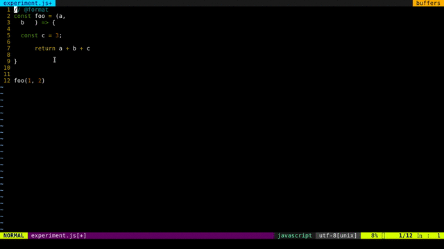

# Links

- [Vim awesome](https://vimawesome.com) &mdash; AWESOME VIM PLUGINS from ACROSS THE UNIVERSE
- [8 Vim Tricks That Will Take You From Beginner to Expert](https://medium.com/swlh/8-vim-tricks-that-will-take-you-from-beginner-to-expert-817ff4870245). Vim is just a text editor. But if you have ever seen an expert use vim, you know that it is shockingly powerful, efficient, and fast.
- [10 simple Linux tips which save 50% of my time in the command line](https://dev.to/javinpaul/10-simple-linux-tips-which-save-50-of-my-time-in-the-command-line-4moo).
- some another... maybe

# Useful Plugins

## [Coc.nvim](https://github.com/neoclide/coc.nvim)


Make your Vim/Neovim as smart as VSCode. *True snippet and additional text editing support*. For [vim-plug](https://github.com/junegunn/vim-plug) users:

```.vimrc
" Use release branch (recommend)
Plug 'neoclide/coc.nvim', {'branch': 'release'}
```

You **have to** install coc extension or configure language servers for LSP support. Install extensions like:

```
:CocInstall coc-json coc-tsserver
```

Checkout wiki for more details:

- [Completion with sources](https://github.com/neoclide/coc.nvim/wiki/Completion-with-sources)
- [Using the configuration file](https://github.com/neoclide/coc.nvim/wiki/Using-the-configuration-file)
- [Using coc extensions](https://github.com/neoclide/coc.nvim/wiki/Using-coc-extensions)
- [Configure language servers](https://github.com/neoclide/coc.nvim/wiki/Language-servers)
- [F.A.Q](https://github.com/neoclide/coc.nvim/wiki/F.A.Q)

Checkout `:h coc-nvim` for vim interface.

### Example vim configuration

Configuration is required to make coc.nvim easier to work with, since it doesn't change your key-mappings or Vim options. This is done as much as possible to avoid conflict with your other plugins.

**Important**: Some Vim plugins could change key mappings. Please use `:verbose imap <tab>` to make sure that your keymap has taken effect.

```
" TextEdit might fail if hidden is not set.
set hidden

" Some servers have issues with backup files, see #649.
set nobackup
set nowritebackup

" Give more space for displaying messages.
set cmdheight=2

" Having longer updatetime (default is 4000 ms = 4 s) leads to noticeable
" delays and poor user experience.
set updatetime=300

" Don't pass messages to |ins-completion-menu|.
set shortmess+=c

" Always show the signcolumn, otherwise it would shift the text each time
" diagnostics appear/become resolved.
if has("patch-8.1.1564")
  " Recently vim can merge signcolumn and number column into one
  set signcolumn=number
else
  set signcolumn=yes
endif

" Use tab for trigger completion with characters ahead and navigate.
" NOTE: Use command ':verbose imap <tab>' to make sure tab is not mapped by
" other plugin before putting this into your config.
inoremap <silent><expr> <TAB>
      \ pumvisible() ? "\<C-n>" :
      \ <SID>check_back_space() ? "\<TAB>" :
      \ coc#refresh()
inoremap <expr><S-TAB> pumvisible() ? "\<C-p>" : "\<C-h>"

function! s:check_back_space() abort
  let col = col('.') - 1
  return !col || getline('.')[col - 1]  =~# '\s'
endfunction

" Use <c-space> to trigger completion.
if has('nvim')
  inoremap <silent><expr> <c-space> coc#refresh()
else
  inoremap <silent><expr> <c-@> coc#refresh()
endif

" Make <CR> auto-select the first completion item and notify coc.nvim to
" format on enter, <cr> could be remapped by other vim plugin
inoremap <silent><expr> <cr> pumvisible() ? coc#_select_confirm()
                              \: "\<C-g>u\<CR>\<c-r>=coc#on_enter()\<CR>"

" Use `[g` and `]g` to navigate diagnostics
" Use `:CocDiagnostics` to get all diagnostics of current buffer in location list.
nmap <silent> [g <Plug>(coc-diagnostic-prev)
nmap <silent> ]g <Plug>(coc-diagnostic-next)

" GoTo code navigation.
nmap <silent> gd <Plug>(coc-definition)
nmap <silent> gy <Plug>(coc-type-definition)
nmap <silent> gi <Plug>(coc-implementation)
nmap <silent> gr <Plug>(coc-references)

" Use K to show documentation in preview window.
nnoremap <silent> K :call <SID>show_documentation()<CR>

function! s:show_documentation()
  if (index(['vim','help'], &filetype) >= 0)
    execute 'h '.expand('<cword>')
  elseif (coc#rpc#ready())
    call CocActionAsync('doHover')
  else
    execute '!' . &keywordprg . " " . expand('<cword>')
  endif
endfunction

" Highlight the symbol and its references when holding the cursor.
autocmd CursorHold * silent call CocActionAsync('highlight')

" Symbol renaming.
nmap <leader>rn <Plug>(coc-rename)

" Formatting selected code.
xmap <leader>f  <Plug>(coc-format-selected)
nmap <leader>f  <Plug>(coc-format-selected)

augroup mygroup
  autocmd!
  " Setup formatexpr specified filetype(s).
  autocmd FileType typescript,json setl formatexpr=CocAction('formatSelected')
  " Update signature help on jump placeholder.
  autocmd User CocJumpPlaceholder call CocActionAsync('showSignatureHelp')
augroup end

" Applying codeAction to the selected region.
" Example: `<leader>aap` for current paragraph
xmap <leader>a  <Plug>(coc-codeaction-selected)
nmap <leader>a  <Plug>(coc-codeaction-selected)

" Remap keys for applying codeAction to the current buffer.
nmap <leader>ac  <Plug>(coc-codeaction)
" Apply AutoFix to problem on the current line.
nmap <leader>qf  <Plug>(coc-fix-current)

" Map function and class text objects
" NOTE: Requires 'textDocument.documentSymbol' support from the language server.
xmap if <Plug>(coc-funcobj-i)
omap if <Plug>(coc-funcobj-i)
xmap af <Plug>(coc-funcobj-a)
omap af <Plug>(coc-funcobj-a)
xmap ic <Plug>(coc-classobj-i)
omap ic <Plug>(coc-classobj-i)
xmap ac <Plug>(coc-classobj-a)
omap ac <Plug>(coc-classobj-a)

" Remap <C-f> and <C-b> for scroll float windows/popups.
if has('nvim-0.4.0') || has('patch-8.2.0750')
  nnoremap <silent><nowait><expr> <C-f> coc#float#has_scroll() ? coc#float#scroll(1) : "\<C-f>"
  nnoremap <silent><nowait><expr> <C-b> coc#float#has_scroll() ? coc#float#scroll(0) : "\<C-b>"
  inoremap <silent><nowait><expr> <C-f> coc#float#has_scroll() ? "\<c-r>=coc#float#scroll(1)\<cr>" : "\<Right>"
  inoremap <silent><nowait><expr> <C-b> coc#float#has_scroll() ? "\<c-r>=coc#float#scroll(0)\<cr>" : "\<Left>"
  vnoremap <silent><nowait><expr> <C-f> coc#float#has_scroll() ? coc#float#scroll(1) : "\<C-f>"
  vnoremap <silent><nowait><expr> <C-b> coc#float#has_scroll() ? coc#float#scroll(0) : "\<C-b>"
endif

" Use CTRL-S for selections ranges.
" Requires 'textDocument/selectionRange' support of language server.
nmap <silent> <C-s> <Plug>(coc-range-select)
xmap <silent> <C-s> <Plug>(coc-range-select)

" Add `:Format` command to format current buffer.
command! -nargs=0 Format :call CocAction('format')

" Add `:Fold` command to fold current buffer.
command! -nargs=? Fold :call     CocAction('fold', <f-args>)

" Add `:OR` command for organize imports of the current buffer.
command! -nargs=0 OR   :call     CocAction('runCommand', 'editor.action.organizeImport')

" Add (Neo)Vim's native statusline support.
" NOTE: Please see `:h coc-status` for integrations with external plugins that
" provide custom statusline: lightline.vim, vim-airline.
set statusline^=%{coc#status()}%{get(b:,'coc_current_function','')}

" Mappings for CoCList
" Show all diagnostics.
nnoremap <silent><nowait> <space>a  :<C-u>CocList diagnostics<cr>
" Manage extensions.
nnoremap <silent><nowait> <space>e  :<C-u>CocList extensions<cr>
" Show commands.
nnoremap <silent><nowait> <space>c  :<C-u>CocList commands<cr>
" Find symbol of current document.
nnoremap <silent><nowait> <space>o  :<C-u>CocList outline<cr>
" Search workspace symbols.
nnoremap <silent><nowait> <space>s  :<C-u>CocList -I symbols<cr>
" Do default action for next item.
nnoremap <silent><nowait> <space>j  :<C-u>CocNext<CR>
" Do default action for previous item.
nnoremap <silent><nowait> <space>k  :<C-u>CocPrev<CR>
" Resume latest coc list.
nnoremap <silent><nowait> <space>p  :<C-u>CocListResume<CR>
```

## [Vim devicons](https://github.com/ryanoasis/vim-devicons)

Supports plugins such as [NERDTree](https://github.com/preservim/nerdtree), [vim-airline](https://github.com/vim-airline/vim-airline), [CtrlP](https://github.com/ctrlpvim/ctrlp.vim), [powerline](https://github.com/powerline/powerline), [denite](https://github.com/Shougo/denite.nvim), [unite](https://github.com/Shougo/unite.vim), [lightline.vim](https://github.com/itchyny/lightline.vim), [vim-startify](https://github.com/mhinz/vim-startify), [vimfiler](https://github.com/Shougo/vimfiler.vim), [vim-buffet](https://github.com/bagrat/vim-buffet) and [flagship](https://github.com/tpope/vim-flagship).

### Features

- Adds filetype glyphs (icons) to various vim plugins.
- Customizable and extendable glyphs settings.
- Supports a wide range of file type extensions.
- Supports popular full filenames, like `.gitignore`, `node_modules`, `.vimrc`, and many more.
- Supports byte order marker (BOM).
- Works with patched fonts, especially [Nerd Fonts](https://github.com/ryanoasis/nerd-fonts).

> See [Detailed Features](https://github.com/ryanoasis/vim-devicons/wiki/Detailed-Features) for more.

> See [Configuration](https://github.com/ryanoasis/vim-devicons/wiki/Extra-Configuration) for a list of configuration and customization options.

### Installation

1. Install a [Nerd Font compatible font](https://github.com/ryanoasis/nerd-fonts#font-installation) or [patch your own](https://github.com/ryanoasis/nerd-fonts#font-patcher). Then set your terminal font (or `guifont` if you are using GUI version of Vim).

2. Install the Vim plugin with your favorite plugin manager, e.g. [vim-plug](https://github.com/junegunn/vim-plug):

   ```
   Plug 'ryanoasis/vim-devicons'
   ```

   > Always load the vim-devicons as the very last one.

3. Configure Vim

   ```
   set encoding=UTF-8
   ```

   > No need to set explicitly under Neovim: always uses UTF-8 as the default encoding.

> See [Installation](https://github.com/ryanoasis/vim-devicons/wiki/Installation) for detailed setup instructions

Use `:help devicons` for further configuration.

### [Using snippets](https://github.com/neoclide/coc.nvim/wiki/Using-snippets)

Coc has snippets support in different ways:

- Snippet completion items from different vim snippet plugins, by using extension like: [coc-ultisnips](https://www.npmjs.com/package/coc-ultisnips) and [coc-neosnippet](https://www.npmjs.com/package/coc-neosnippet).
- Snippet kind of completion item from language servers, which are snipmate format.
- Snippet completion items from coc extensions that contribute VSCode snippets.

## [VIm prettier](https://github.com/prettier/vim-prettier)

A vim plugin wrapper for prettier, pre-configured with custom default prettier settings. By default it will auto format **javascript**, **typescript**, **less**, **scss**, **css**, **json**, **graphql** and **markdown** files if they have/support the "@format" pragma annotation in the header of the file.



### INSTALL

To install with vim 8+ plugins, simply clone to your `~/.vim/pack/plugins/start` directory, and add `packloadall` to your `.vimrc` (if you haven't already).

```
mkdir -p ~/.vim/pack/plugins/start
git clone https://github.com/prettier/vim-prettier ~/.vim/pack/plugins/start/vim-prettier
```

`.vimrc`:

```
packloadall
```


Ultisnips

https://vimawesome.com/plugin/ultisnips

https://github.com/sirver/ultisnips

